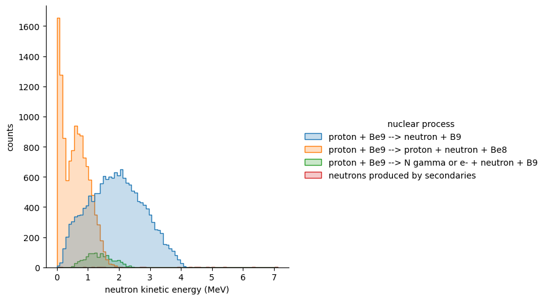
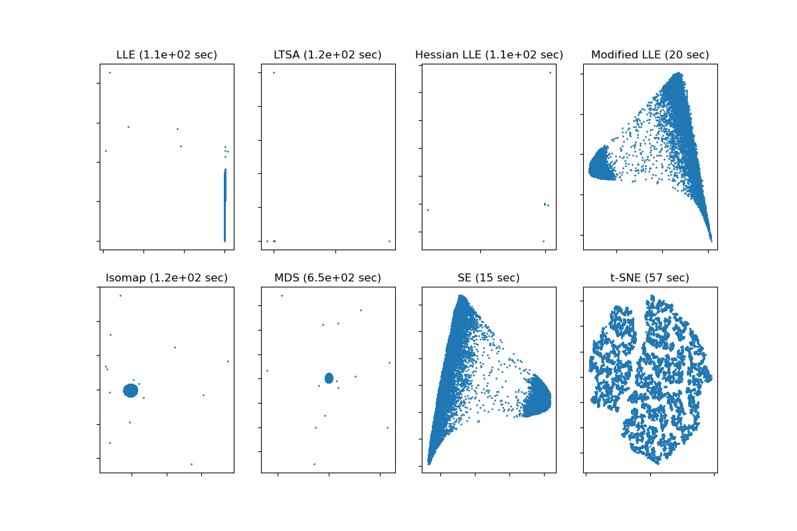
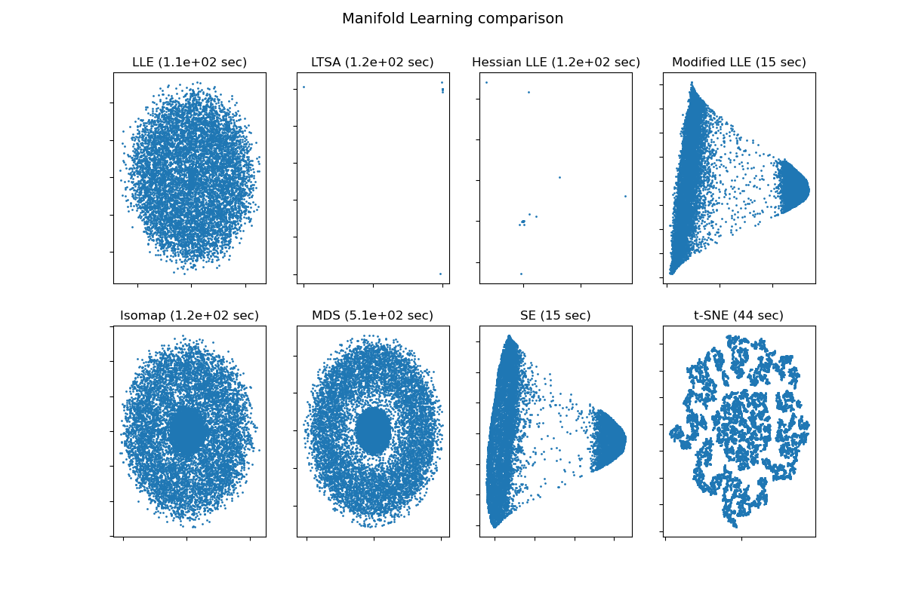
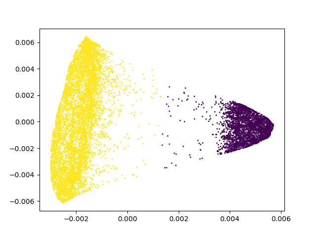
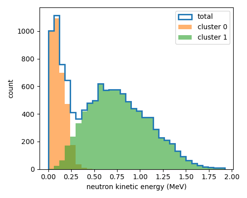
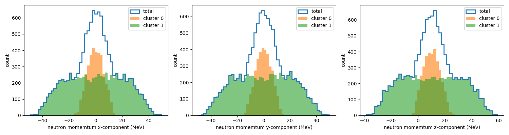
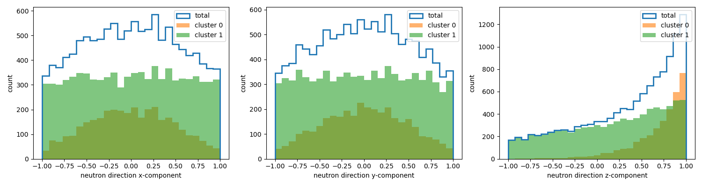

# Analysis of the proton-on-beryllium simulation data
The output of the [beam-on-target](https://github.com/kaikai581/bnct-exercise/tree/master/beam-on-target) simulation is a ROOT file with two trees. One records all secondary particles generated from the primary protons and the subsequent secondary particles. The other records nuclear processes through which secondary particles are produced. Since this simulation is for studying generated neutrons, I will be focusing on the interesting features in neutron kinematic variables in the following sections.

## Neutron angular distribution
We are very curious about the neutron angular distribution since this parameter affects many design choices, especially those of the beam shape assembly.

So, here is the neutron angular distribution.
<p align="center" width="100%">
    
</p>
There are basically no counts around 0, the most forward going direction. This is extremely counterintuitive, since one would expect most secondary particles should start in the same direction as the beam.

In order to understand what happens here, I plot neutron directions (1000 randomly sampled) on a unit sphere.
<p align="center" width="100%">
    
</p>
In this plot, the beam direction is from the bottom to the top. It is clearly seen that around the north pole, the event density is no where near zero. Some moments of contemplation led to the following explanation.

### The solid angle effect
Suppose we have a uniform event distribution on a unit sphere, which means a constant number per unit area on the unit sphere. Then, the number of events  in a solid angle  is simply
<p align="center" width="100%">
  
</p>
, where  is the constant event density, and .

However, when we are asking the number of events between  and , due to azimuthal symmetry, we actually integrate over  to get
<p align="center" width="100%">
  
</p>
The issue is, the area around the equator is much larger than that around the north pole. This can be seen from this figure.

Therefore, with uniform density, one gets much more counts around the equator due to a large area while much fewer counts around the poles due to a vanishing area. To get the uniform density, we have to divide out the geometric factor and get
<p align="center" width="100%">
  
</p>

Another perspective is that we can project the direction points on the unit sphere to the z-axis. This way, we can avoid the geometric effect.

In either perspective, we plot number of events in equal bins of  to get the following plot.
<p align="center" width="100%">
    
</p>
Now, the forward going direction is at 1, and we can clearly see more events are going forwardly.

I should have been very familiar with this effect. However, when a problem like this is suddenly thrown at me, sometimes I still need to think over again.

## Neutron kinetic energy distribution
The second feature that catches my eye is this neutron kinetic energy distribution.
<p align="center" width="100%">
    
</p>

With energies below 1.6 MeV, there seems to be a double peak structure. Here is a [simulation result](https://iopscience.iop.org/article/10.1088/1742-6596/1144/1/012004) from MCNP.
<p align="center" width="100%">
  
</p>
It is know to have a 1.6 MeV peak due to the smallest neutron biding
energy of the <sup>9</sup>Be isotope. However, there is no peak at 0 energy. It again can be interesting to take a closer look at this feature.

The first idea I come across is to separate the spectrum according to the neutron production channels and hope that each peak actually comes from a different channel. Here is the result.
<p align="center" width="100%">
    
</p>
Unfortunately, the double-peak feature all comes from the <sup>9</sup>Be(p,pn)<sup>8</sup>Be channel.
Fine. Let's take only neutrons from that double-peak process and dig deeper. Since two peaks suggest two clusters of events, let's try to apply some clustering algorithm from machine learning and see what can be understood out of the results.

### Comparison of clustering algorithms
For all neutrons from the channel <sup>9</sup>Be(p,pn)<sup>8</sup>Be, I select these seven variables as my features, . The first three are the neutron vertex, the second three are 3-momentum, and the last one is neutron kinetic energy. These seven variables are not all independent. However, modern machine learning algorithms should have no issues dealing with highly correlated features.

I have applied the so-called manifold learning algorithm to my seven dimensional dataset and embed data points into 2D for visualization.
Here are the results with standardized data.
<p align="center" width="100%">
    
</p>
Here are the results without any data preprocessing.
<p align="center" width="100%">
    
</p>
Here are some of the very interesting features from the results.

1. Modified LLE and SE (Spectral Embedding) works very well and are extremely fast in both cases.
2. The very famous tSNE algorithm shows two clear islands with standardized data, but hard to tell with unstandardized data.
3. Other algorithms give unexciting results. Isomap and MDS, in particular, work better with unstandardized data.

People say one should always perform data preprocessing to get better results. My experiments on this particular dataset show the opposite, and remind me of the [no free lunch theorem](https://www.kdnuggets.com/2019/09/no-free-lunch-data-science.html): you will never know until you see the outcome.

### Results with Spectral Embedding
I decide to go with Spectral Embedding with unstandardized data for good clustering performance and computing efficiency. Then I apply K-means directly to the 2D output to get the cluster labels. (Although people don't suggest to do clustering with visualization algorithms, I see no harm here.)
Here is the result.
<p align="center" width="100%">
    
</p>
One cannot expect a cleaner result besides textbook examples!

Now, we can plot the 1D distributions separated by cluster labels. It turns out that the position variables are not too informative, so I will only show 4-momentum related variables.

This is the kinetic energy.
<p align="center" width="100%">
    
</p>
Here are the momentum components.
<p align="center" width="100%">
    
</p>
And here are the direction components.
<p align="center" width="100%">
    
</p>
It is crystal clear that neutrons are generated by sampling from two groups of 4-momentum distributions. Neutrons in the low energy group tend to go forwardly, while those in the higher energy group seem to have a momentum distribution of a box shape.

I am thinking whether there are two different models that have an overlapping energy range, and when neutrons are produced, some mechanism is used to choose from the two models, leading to the deficit in the transition region. I print out the physics model these neutrons are produced with.
```
---------------------------------------------------
                           Hadronic Processes for proton

  Process: hadElastic
        Model:             hElasticCHIPS: 0 eV  ---> 100 TeV
     Cr_sctns:  BarashenkovGlauberGribov: 0 eV  ---> 100 TeV

  Process: protonInelastic
        Model:                      FTFP: 3 GeV ---> 100 TeV
        Model:            BertiniCascade: 1 GeV ---> 6 GeV
        Model:            Binary Cascade: 0 eV  ---> 1.5 GeV
     Cr_sctns:     G4ParticleInelasticXS: 0 eV  ---> 100 TeV
```
With proton inelastic process, only Binary Cascade is in the energy range, and no others are printed. If there is any jump in sampling distributions, it all happens inside a single model.

I am by no means in any position to improve physics models, if my analysis is correct. I will halt my investigation, and guess that Geant4 does not produce the most precise simulation in neutron production at such low energy.

# Afterthought
Although I am not sure how much I should trust the results of the simulation for this particular use case, Geant4 is still the only opensource option we have with a very large and active community.

Since we cannot make any design decision out of the blue, I personally think it is worth working out a best possible simulation with Geant4 for reference.
