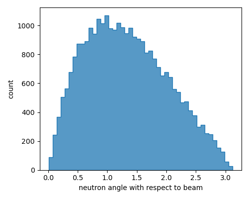
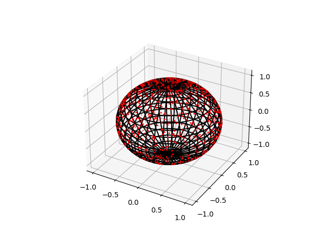
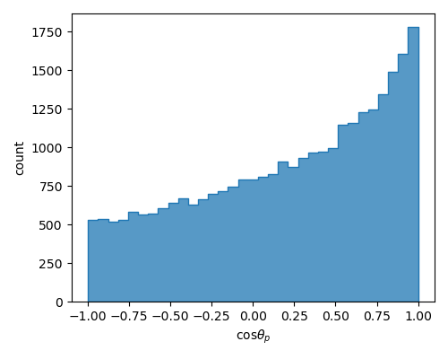
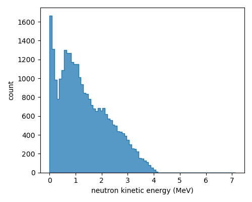

# Analysis of the proton-on-beryllium simulation data
The output of the [beam-on-target](https://github.com/kaikai581/bnct-exercise/tree/master/beam-on-target) simulation is a ROOT file with two trees. One records all secondary particles generated from the primary protons and the subsequent secondary particles. The other records nuclear processes through which secondary particles are produced. Since this simulation is for studying generated neutrons, I will be focusing on the interesting features in neutron kinematic variables in the following sections.

## Neutron angular distribution
We are very curious about the neutron angular distribution since this parameter affects many design choices, especially those of the beam shape assembly.

So, here is the neutron angular distribution.

    

There are basically no counts around 0, the most forward going direction. This is extremely counterintuitive, since one would expect most secondary particles should start in the same direction as the beam.

In order to understand what happens here, I plot neutron directions on a unit sphere.

    

In this plot, the beam direction is from the bottom to the top. It is clearly seen that around the north pole, the event density is no where near zero. Some moments of contemplation led to the following explanation.

### The solid angle effect
Suppose we have a uniform event distribution on a unit sphere, which means a constant number per unit area on the unit sphere. Then, the number of events  in a solid angle  is simply

  

, where  is the constant event density, and .

However, when we are asking the number of events between  and , due to azimuthal symmetry, we actually integrate over  to get

  

The issue is, the area around the equator is much larger than that around the north pole. This can be seen from this figure.

Therefore, with uniform density, one gets much more counts around the equator due to a large area while much fewer counts around the poles due to a vanishing area. To get the uniform density, we have to divide out the geometric factor and get

  

Another perspective is that we can project the direction points on the unit sphere to the z-axis. This way, we can avoid the geometric effect.

In either perspective, we plot number of events in equal bins of  to get the following plot.

    

Now, the forward going direction is at 1, and we can clearly see more events are going forwardly.

I should have been very familiar with this effect. However, when a problem like this is suddenly thrown at me, sometimes I still need to think over again.

## Neutron kinetic energy distribution
The second feature that catches my eye is this neutron kinetic energy distribution.

    

